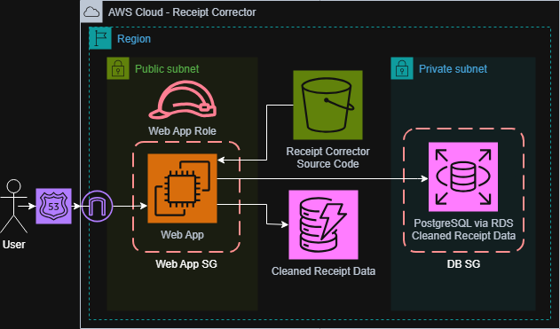
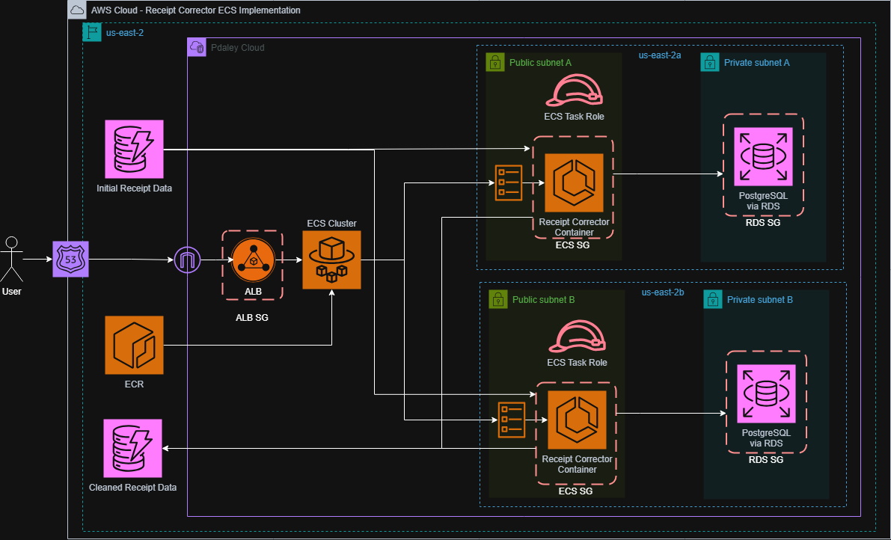

# Overview
This project is a containerized Python web application designed to facilitate human-in-the-loop data validation. The application ingests raw data from a DynamoDB table and presents it in an editable web interface, allowing users to manually review and correct any errors before the cleaned data is persisted to both an RDS relational database and a DynamoDB table. The container image is stored and managed in Amazon ECR, enabling consistent and reproducible deployments across environments.
# Architecture
The networking environment is provisioned entirely from scratch using a custom VPC, designed with both public and private subnets, internet gateways, and routing tables to ensure proper network segmentation and controlled traffic flow. The application integrates multiple data stores, leveraging DynamoDB for raw data ingestion and RDS for structured relational storage of the validated output, demonstrating a full-stack approach to cloud architecture that spans containerization, networking, and both relational and non-relational databases.
# Security
Network-level security is enforced through granular security groups configured following the principle of least privilege. Each component of the architecture is restricted to only accept traffic from explicitly authorized sources, ensuring that no service is exposed beyond its intended scope and that the overall application maintains a strong and deliberate security boundary throughout.
# Containerized Deployment & Infrastructure
The application is deployed as a containerized service on Amazon ECS, leveraging Fargate to eliminate the need for managing underlying infrastructure. An Application Load Balancer distributes incoming traffic across multiple containers spread over two subnets in separate Availability Zones, ensuring high availability and resilience against single-zone failures. Because ECS clustering makes horizontal scaling straightforward, the infrastructure is well-positioned to handle spikes in load with minimal configuration changes.
For data persistence, the containers communicate with an Amazon RDS instance hosted in a private subnet, keeping the database layer isolated from public internet access and ensuring sensitive data remains protected within the VPC.
# CI/CD Pipeline
This repository uses a GitHub Actions workflow to automate the full build and deployment process. On every push, the pipeline pulls the latest code changes, runs the test suite, and builds a new Docker image, pushes it to Amazon ECR, and triggers a rolling deployment to ECS. This eliminates the need for manual builds and deployments, reducing human error and ensuring that only tested, validated code reaches the target environment.
# System Diagram - EC2 Implementation

# System Diagram - ECS Implementation
